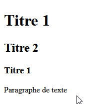
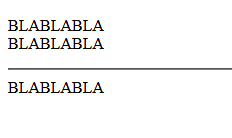
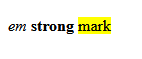
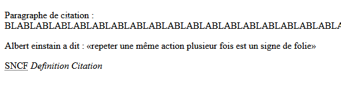
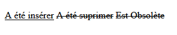
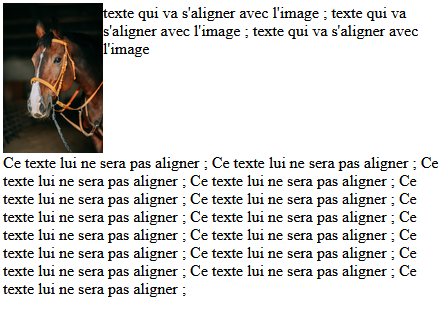
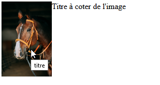
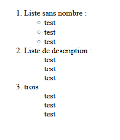
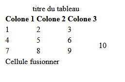
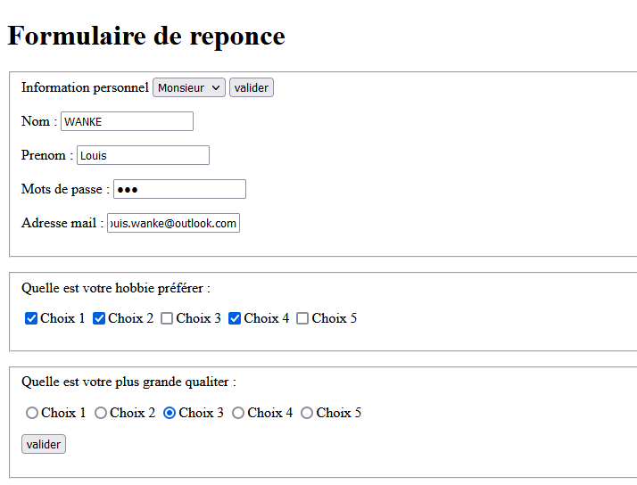

# Base en HTML

## Structure de base du code HTML :

<p>

``` html
<!DOCTYPE html>
<html>
    <head>
        <title>Titre de la page</title>
        <link rel="stylesheet" href="style/monstyle.css" type="text/css">
    </head>
    <body>
        <h1>Titre 1</h1> <!--  Ceci est un commentaire -->
        <h2>Titre 2</h2>
        <h3>Titre 1</h3>
        <p>
            Paragraphe de texte
        </p>
    </body>
</html>
```

 

## Les balises de base :


#### Insérer une image :

``` html

```

***src= "image.jpg" :*** Emplacement de l'image local / url 

***alt= "desc" :*** Alternative si l'image n'ai pas disponible ou description de l'image pour les malvoyant

***title= "titre" :*** Titre de l'image 

***width="400" :*** Largeur de l'image

***heigth="450" :*** Hauteur de l'image


#### Les saut de ligne et de section :

```html
<p>
    BLABLABLA
    <br/> BLABLABLA
    <hr/> BLABLABLA
</p>
```



***<!-- <br/>--> :*** A la ligne

***<hr/> :*** Section suivante


#### Mise en valeur :

``` html
<em>em</em> <!--  Ceci est un commentaire -->
<strong>strong</strong> 
<mark>mark</mark>
```



***<em> :*** Mettre un peu en valeur <em/>

***<strong> :*** Mettre beaucoup en valeur <strong/>

***<mark> :*** Distinguer sans grande importance <mark/>


#### Block de citation :

```html
<blockquotes>
    Paragraphe de citation : BLABLABLABLABLABLABLABLABLABLABLABLABLABLABLABLABLABLABLABLABLABLABLABLABLABLABLABLABLABLABLABLABLABLABLABLA
<blockquotes/>
<p>
    Albert einstain a dit : <q>repeter une même action plusieur fois est un signe de folie</q>
</p>
<abbr title="Sociéter National de Chemain de fer Français">SNCF</abbr>

<dfn>Definition</dfn>

<cite>Citation</cite>
```



***<blockquotes> :*** Paragraphe citation <blockquotes/> 

***<q> :*** Citation dans texte <q/>

***<abbr title="Sociéter National de Chemain de fer Français"> :*** <abbr title="Sociéter National de Chemain de fer Français">SNCF</abbr> </abbr>

 ***<cite> :*** Citation <cite/>


#### Indication de modification :

``` html
<ins>A été insérer</ins>
<del>A été suprimer</del>
<s>Est Obsolète</s>
```



***<ins> :*** A été insérer </ins>

***<del> :*** A été supprimer</del>

***<s> :*** Est Obsolète <s/>


## Attribut supplémentaire pour les images :

#### Alignement des images avec le texte :

``` html
<p>
    
    texte qui va s'aligner avec l'image ; texte qui va s'aligner avec l'image ; texte qui va s'aligner avec l'image
   <figcaption>Ce texte lui ne sera pas aligner ; Ce texte lui ne sera pas aligner ; Ce texte lui ne sera pas aligner ; Ce texte lui ne sera pas aligner ; Ce texte lui ne sera pas aligner ; Ce texte lui ne sera pas aligner ; Ce texte lui ne sera pas aligner ; Ce texte lui ne sera pas aligner ; Ce texte lui ne sera pas aligner ; Ce texte lui ne sera pas aligner ; Ce texte lui ne sera pas aligner ; Ce texte lui ne sera pas aligner ; Ce texte lui ne sera pas aligner ; Ce texte lui ne sera pas aligner ; Ce texte lui ne sera pas aligner ; </figcaption>
</p>
```



***align="left" :*** aligne l'image a gauche est permet si elle est déclarer dans un balise paragraphe de ce positionner a coter d'une image

***<div style="clear:both;"> :*** Permet de supprimer l'alignement avec l'image </div>


#### Information sur les images :

```html
<figcaption>Titre à coter de l'image<figcaption/>
```



***<figcaption> :*** Affiche un titre rattacher à l'image <figcaption/>

***title="titre" :*** Fait l'infobulle


## Les listes :

```html
        <ol>
            <li>Liste sans nombre :
                <ul>
                    <li>test</li>
                    <li>test</li>
                    <li>test</li>
           	    </ul>
            </li>
            <li>Liste de description :
                <ul>
                    <dl>test</dl>
                    <dl>test</dl>
                    <dl>test</dl>
                </ul>
            </li>
            <li>trois</li>
                <ul>
                    <dt>test</dt>
                    <dt>test</dt>
                    <dt>test</dt>
                </ul>        
        </ol>
```



***<ol>  :*** Liste ordonnée avec des numéros <ol/>

***<ul> :*** Liste non-ordonnée sans numéros <ul/>

***<li> :*** Emplacement des puces <li/>

***<dl> :*** Puces de definition <dl/>

***<dt> :*** Puces à definir <dt/>


## Les liens :

```html
<a href="https://www.google.fr">Rechercher</a>
<a href="page2.html">Page2</a>
<a href="#mon_ancre">Aller vers l'ancre</a>
<a href="mailto:bob@truc.com">e-mail !</a>
<a href="image.jpg">Télécharger</a>

<h2 id="mon_ancre">Section plus bas</h2>
```

<!--<a href="lien">titre</a> --> : Sert a crées un lien vers un site externe, page interne, ancre, email, fichier (telechargement)

***id="non de l'ancre" :*** création d'une ancre


## Les tableau :

``` html
 <table>
	<caption>titre du tableau</caption>
	<th>Colone 1</th>
	<th>Colone 2</th>
	<th>Colone 3</th>
	<tr>
		<td>1</td>
		<td>2</td>
		<td>3</td>
		<td rowspan = 4>10</td>
	</tr>
	<tr>
		<td>4</td>
		<td>5</td>
	<td>6</td>
	</tr>
	<tr>
		<td>7</td>
		<td>8</td>
	<td>9</td>
	</tr>
	<tr>
	<td colspan = 3>Cellule fusionner</td>
	</tr>
</table>
```

 

***<table> :*** Déclare un tableau

***<caption> :*** Titre du tabeau

***<th> ou <thead> :*** Entête du tableau

***<tr> :*** Ligne du tableu

***<td> :*** Cellule d'une ligne du tableau

***rowspan :*** Fusion vertical des cellules

***colspan :*** Fusion horizontal des cellules


## Les Formulaires :

```html
<h1>Formulaire de reponce</h1>
        <fieldset>Information personnel
            <select>
                <option>Monsieur</option>
                <option>Madame</option>
                <option>Autre</option>
            </select>
            <input type="submit" value="valider">
        </p>
        <p>
            Nom : 
            <input type="text"/>
        </p>
        <p>
            Prenom : 
            <input type="text"/>
        </p>
        <p>
            Mots de passe : 
            <input type="password"/>
        </p>
        <p>
            Adresse mail : 
            <input type="email"/>
        </p>
        </fieldset>
        <p>
        <fieldset>Quelle est votre hobbie préférer : 
                <p>
                <input type="checkbox">Choix 1</input>
                <input type="checkbox">Choix 2</input>
                <input type="checkbox">Choix 3</input>
                <input type="checkbox">Choix 4</input>
                <input type="checkbox">Choix 5</input>
                <p>
        </fieldset>
        <p>
            <fieldset>Quelle est votre plus grande qualiter : 
                    <p>
                    <input type="radio" name="quali">Choix 1</input>
                    <input type="radio" name="quali">Choix 2</input>
                    <input type="radio" name="quali">Choix 3</input>
                    <input type="radio" name="quali">Choix 4</input>
                    <input type="radio" name="quali">Choix 5</input>
                    <p>
                    <input type="submit" value="valider">
            </fieldset>
```



***<fieldset> :*** Crée un champs 

***<input type="submit" value="valider"> :*** Crée un bouton valider

***<input type="text"/> :*** Crées une zone de questionnaire text

***<input type="password"/> :*** Crées une zone de questionnaire mots de passe

***<input type="checkbox">Choix 1</input> :*** Crées une case à cocher

***<input type="radio" name="quali">Choix 1</input> :*** Crées un rond à cocher (penser à mettre le même non partout pour que le rond soit liée)

***<select> et <option> :*** Select crée une liste déroulante et option rajoutre des choix à la liste

***<optgroup label="Nom_de_label">Option</optgroup>:*** Crées des sous groupe dans la liste 


## Les contenus multimédia

``` html
<audio src="fichier.mp3" controls loop autoplay></audio>
<iframe width="560" height="315" src="https://www.youtube.com/embed/9iPKRrS6AR4" title="YouTube video player" frameborder="0" allow="accelerometer; autoplay; clipboard-write; encrypted-media; gyroscope; picture-in-picture" allowfullscreen></iframe>
```

***<audio> :*** ajoute de la musique ; control un barre de gestion ; loop faire ce repeter et autoplay lance la musique en automatique

***<iframe> :*** ajoute une intégration d'un autre site ; ce gère comme une image


