# Langage de manipulation des données fichier  2

[TOC]


<div style="text-align:left;margin-left:40px;">
 <div>
 
</div>


```sql
 SELECT [ALL] | [DISTINCT] <liste des noms de colonnes> | *
    FROM <Liste des tables>
    [WHERE <condition logique>]
    [ORDER BY ...]
    [GROUP BY ...]
    [HAVING ...]
```


### 2.3 Interrogation de plusieurs tables : la jointure

La jointure est l’opération permettant d’obtenir des informations provenant de plusieurs tables. Les jointures s'appuient sur les clefs primaires et les clefs étrangères des tables.


Deux syntaxes existent, conduisant au même résultat :
- la syntaxe SQL89 (SQL-1)
où la liste des tables est indiquée dans le FROM,
et la condition d'égalité pour les champs communs aux deux tables dans le WHERE,
- la syntaxe SQL92 (SQL-2)
où les tables sont indiquées dans le FROM, combinées avec INNER JOIN,
avec les champs sur lesquels portent la jointure.

**Remarque :** le point fort du SQL-2 est de séparer ce qui relève de la jointure du reste de la requête. La clause WHERE contiendra donc uniquement les éventuelles restrictions.

**R12** *: « Pour chaque numéro de vol, quel est le nom de l'avion assurant le vol ? »*

<div style="text-align:left;margin-left:40px;">
 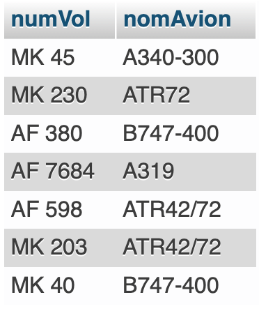
</div>


```sql
SELECT numVol, nomAvion
FROM Vols
	INNER JOIN Avions
    	ON Vols.numAvion = Avions.numAvion;
    	
 OU
  
SELECT numVol, nomAvion
FROM Avions
	INNER JOIN Vols
    	ON Avions.numAvion = Vols.numAvion;
 
```

**R13** *: « Quel est le nom du pilote qui assure le vol AF7684 ? »*

<div style="text-align:left;margin-left:40px;">
 
</div>

```sql
SELECT nomPilote
FROM Pilotes
	INNER JOIN Vols
    	ON Pilotes.numPilote = Vols.numPilote
WHERE numVol LIKE "AF 7684";
```


**R14** *: « Quels sont les noms des pilotes qui ont déjà piloté un "BOEING 747-400" ? »*

<div style="text-align:left;margin-left:40px;">
 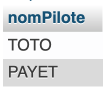
</div>

```sql
SELECT nomPilote
FROM Pilotes
	INNER JOIN Vols
    	ON Pilotes.numPilote = Vols.numPilote
       INNER JOIN Avions
       			ON Vols.numAvion = Avions.numAvion
WHERE nomAvion LIKE "B747-400";

ou

SELECT nomPilote
FROM Pilotes, Vols, Avions
Where
	Pilotes.numPilote = Vols.numPilote
	AND Vols.numAvion = Avions.numAvion
	AND nomAvion LIKE "B747-400";

```


### 2.4 Tri des résultats

Les enregistrements constituant le résultat d’une requête sont obtenus dans un ordre dépendant des mécanismes internes du SGBDR utilisé. L'ajout de critères de tri en fin d'instruction SELECT permettra d'ordonner le résultat de manière ascendante ou descendante, suivant un ou plusieurs champs.

Les critères de tri sont indiqués dans la clause **ORDER BY** :

```sql
    ORDER BY <Champ 1> [ASC|DESC] [, <Champ 2> [ASC|DESC]] ...
```

Le tri est d’abord effectué selon le premier champ, puis les enregistrements ayant une même valeur pour ce premier champ sont classées selon le deuxième champ et ainsi de suite. Pour chaque champ, le tri peut être ascendant (ASC, valeur par défaut) ou descendant (DESC).

**R15** *: « Quelle est la liste détaillée des avions ? Les avions seront triés par ordre alphabétique croissant de nom. »*

```sql
SELECT numAvion, nomAvion, capacite
FROM Avions
ORDER BY nomAvion;
```

<div style="text-align:left;margin-left:40px;">
 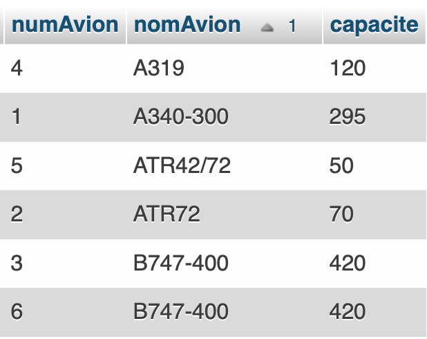
</div>

**R16** *: « Quelle est la liste des pilotes ayant un bonus ? Les bonus seront classés dans l’ordre décroissant. »*

```sql
SELECT nomPilote, bonus
FROM Pilotes
WHERE bonus > 0
ORDER BY bonus DESC;
```

<div style="text-align:left;margin-left:40px;">
 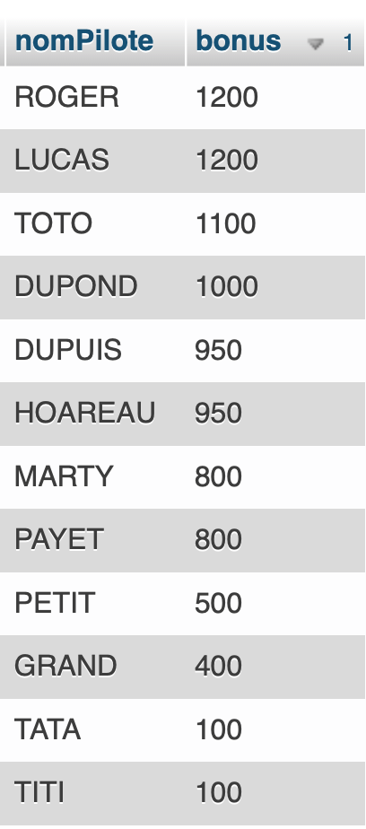
</div>


### 2.5 Calculs arithmétiques

L'objectif est de sélectionner des lignes d'une ou plusieurs tables selon certains critères. La clause **WHERE** suivie d'une condition logique va permettre de filtrer les lignes affichées. La condition est une expression logique ayant soit la valeur « VRAI », soit la valeur « FAUX. » Elle sera évaluée pour chaque enregistrement de la table. Seuls les enregistrements pour lesquels la condition est à « VRAI » seront conservés.


#### 2.5.1 Calculs sur champs

Les champs d’une table peuvent être utilisés pour réaliser des calculs.

**R17** *: « Quels sont les pilotes qui gagnent plus de 4200 € (bonus compris) ? »*

```sql
SELECT nomPilote
FROM Pilotes
WHERE 
	salaire + bonus >= 4200
    OR salaire >= 4200
    OR bonus >= 4200;
```

<div style="text-align:left;margin-left:40px;">
 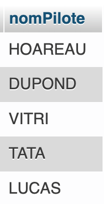
</div>

#### 2.5.2 Les fonctions intégrées

Ces fonctions du langage SQL effectuent un calcul sur des ensembles de valeurs.

```sql
    AVG(<Champ>) : moyenne arithmétique
    SUM(<Champ>) : somme arithmétique
    MAX(<Champ>) : valeur maximum
    MIN(<Champ>) : valeur minimum
    COUNT(*), COUNT(<Champ>), COUNT(DISTINCT <Champ>) : nombre d'enregistrements
```

**R18** *: « Quel est le salaire moyen des pilotes ? »*

```sql
SELECT AVG(salaire) AS salaireMoyen
FROM Pilotes
```

<div style="text-align:left;margin-left:40px;">
 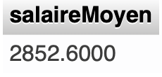
</div>
**R19** *: « Quel est le plus gros salaire ? »*

```sql
SELECT MAX(salaire) "Le plus gros salaire"
FROM Pilotes
```

<div style="text-align:left;margin-left:40px;">
 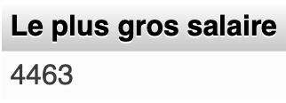
</div>

**Remarque :** L'utilisation de AS permet de donner un nom d’alias à une colonne créée.

**R20** *: « Qui gagne le plus gros salaire ? »*

```sql
SELECT nomPilote, salaire
FROM Pilotes
WHERE salaire = (SELECT MAX(salaire)
                 FROM Pilotes);
```

<div style="text-align:left;margin-left:40px;">
 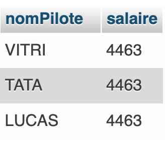
</div>

**R21** *: « Combien d’avions disposent de plus de 100 places ? »*

```sql
SELECT COUNT(*) Nombre
FROM Avions
WHERE capacite >= 100;
```

<div style="text-align:left;margin-left:40px;">
 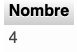
</div>

**R22** *: « Combien d’avions différents existe-t-il ? »*

```sql
SELECT COUNT(DISTINCT nomAvion)
FROM Avions;
```

<div style="text-align:left;margin-left:40px;">
 
</div>

**R23** *: « Quel est le pourcentage de pilotes avec bonus ? »*

(résultat : nbrePilotesBonus *100/nbrePilotes)

```sql
SELECT
	(
        (SELECT COUNT(*)
		FROM Pilotes
		WHERE bonus > 0)
        *100
        / (SELECT COUNT(*)
           FROM Pilotes)
      ) AS "%PiloteAvecBonus";
```

<div style="text-align:left;margin-left:40px;">
 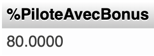
</div>


### 2.6 Regroupement des résultats

Comme dans un tableur, le regroupement d'enregistrements de la liste résultat d'une requête peut permettre de réaliser des opérations par groupe, par exemple des opérations statistiques. Cette opération se réalise à l'aide de la clause **GROUP BY**, suivie du nom de chaque colonne sur laquelle on veut effectuer des regroupements.

**R24** *: « Combien y a-t-il de vol(s) au départ de chaque ville ? »*

```sql
SELECT villeDepart, COUNT(villeDepart) AS nbVols
FROM Vols
GROUP BY VilleDepart;

ou 

SELECT villeDepart, COUNT(*) AS nbVols
FROM Vols
GROUP BY VilleDepart;
```

<div style="text-align:left;margin-left:40px;">
 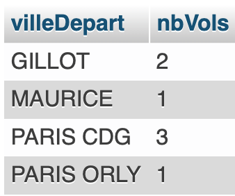
</div>

**R25** *: « Combien y a-t-il de places tous vols confondus au départ de chaque ville ? »*

```sql
SELECT villeDepart, SUM(capacite) AS nbPlaces
FROM Vols
	INNER JOIN Avions
    		ON Vols.numAvion = Avions.numAvion
GROUP BY villeDepart;
```

<div style="text-align:left;margin-left:40px;">
 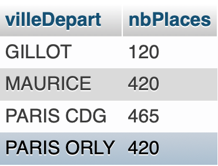
</div>

La clause **HAVING** va de pair avec la clause **GROUP BY**, elle permet d'appliquer une restriction sur les groupes créés grâce à la clause **GROUP BY**.

**R26** *: « Quelles sont les villes pour lesquelles il y a au moins 2 vols à l’arrivée ? »*

```sql
SELECT villeArrivee, COUNT(villeArrivee) As nbrArrivees
FROM Vols
GROUP BY villeArrivee
HAVING COUNT(villeArrivee) >=2;


ou 

SELECT villeArrivee, COUNT(*) As nbrArrivees
FROM Vols
GROUP BY villeArrivee
HAVING COUNT(villeArrivee) >=2;
```

<div style="text-align:left;margin-left:40px;">
 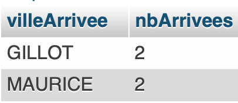
</div>

<div style="page-break-after:always" />
## 3. Mise à jour des données


### 3.1 Ajout de données

La commande **INSERT** permet l'insertion de nouvelles données dans une table :

```sql
    INSERT INTO NomDeLaTable [(liste des noms de champs)]
    VALUES (Valeur1, Valeur2, Valeur3…)
```


**Remarques :**
- les crochets après nomDeLaTable sont équivalent à # dans python
- les données sont affectées aux colonnes dans l'ordre dans lequel elles ont été créées,
- les chaînes de caractères et les dates sont à délimiter par des guillemets.

**R27** *: « Ajouter l’avion suivant dans la base : N° 7 ; modèle A319 ; capacité 100 »*

```sql
INSERT INTO Avions (numAvion, nomAvion, capacite)
VALUES (7, "A319", 100);
```


### 3.2 Modification de données


La commande **UPDATE** permet de modifier des enregistrements dans une table :

```sql
    UPDATE NomDeLaTable
    SET Colonne1 = Expression1 [, Colonne2 = Expression2]...
    [WHERE <condition logique>]
```

**Remarques :**
- Expression1, Expression2 peuvent être une constante, une expression algébrique ou le résultat provenant d'une clause SELECT,
- la clause facultative WHERE permet de préciser les enregistrements sur lesquels la mise à jour va s'appliquer.

**R28** *: « Appliquer une augmentation de 5 % sur le salaire de tous les pilotes. »*

```sql
UPDATE Pilotes
SET salaire = salaire * 1,05;
```


**R29** *: « Pour tous les pilotes, y compris sans bonus, majorer de 25 € les bonus inférieurs à 1 000 €. »*

```sql
UPDATE Pilotes
SET bonus = bonus + 25
WHERE bonus < 1000;
UPDATE Pilotes
SET bonus = 25 
WHERE bonus IS NULL;


ou

UPDATE Pilotes
SET bonus = 0
WHERE bonus IS NULL;
UPDATE Pilotes
SET bonus = bonus + 25
WHERE bonus < 1000;


```


### 3.3 Suppression de données


La commande **DELETE** permet de supprimer des enregistrements dans une table :
- la clause **FROM** précise la table sur laquelle la suppression s'effectue,
- la clause **WHERE** précise l'ensemble des lignes qui seront supprimées.

```sql
    DELETE
    FROM NomDeLaTable
    [WHERE <condition logique>]
```

**Remarques :**
- la commande DELETE est à utiliser avec précaution car l'opération de suppression est irréversible,
- il préférable et très prudent de s'assurer dans un premier temps que les lignes sélectionnées sont bien les lignes que l'on désire supprimer,
- la clause WHERE est facultative, mais sera la plupart du temps renseignée sans quoi, c’est le contenu complet de la table qui sera effacé.

**R30** *: « Supprimer l’avion ajouté par la requête R27. »*

```sql
 DELETE FROM Avions
 WHERE numAvions = 7;
```


## 4. Application

**R31** *: « Quels sont les vols (numVol) triés par ordre croissant, assurés par Toto ? »*

```sql
SELECT numVol, nomPilote
FROM Vols 
	INNER JOIN Pilotes 
    	ON Vols.numPilote = Pilotes.numPilote
WHERE nomPilote = 'toto'
ORDER BY numvol ASC
```

**R32** *: « Combien de vols y a-t-il au départ de Gillot ? »*

```sql
SELECT COUNT(*) Nombre
FROM Vols 
WHERE villeDepart = 'gillot'
```

**R33** *: « Combien de vols sont assurés par des ATR ? »*

```sql
SELECT nomAvion
FROM Avions
WHERE nomAvion LIKE 'ATR%';
```

**R34** *: « Quelle est la liste des vols (numVol et numAvion) au départ de Paris dont la capacité est supérieure à 400 places ? »*

```sql
SELECT numVol, numAvion
FROM Vols
	INNER JOIN Avions
		ON Vols.numAvion = Avions.numAvion
WHERE nomPilote = 'toto'	
```

**R35** *: « Quelle est la liste des avions (numAvion et nomAvion) pilotés par le pilote nommé Hoareau au départ de Gillot ? »*

```sql

```

